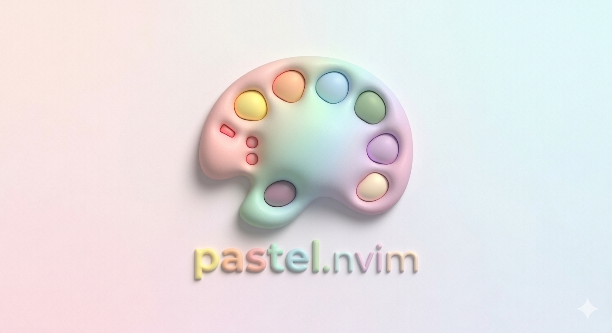

A modern Neovim colorscheme plugin featuring beautifully crafted pastel themes with rich customization, plugin integrations, and flexible styling.

---

### ✨ Features

- 🎨 Beautiful pastel color schemes
- 🌗 Automatic dark/light background support
- 🧩 Built-in highlights for many popular plugins
- ⚙️ Fully customizable colors, highlights, and styles
- 🪶 Lightweight and fast
- 🔍 Per-filetype configuration support
- 🚫 Fine-grained exclusion system

---

### 📦 Installation

Install using your preferred plugin manager.

- lazy.nvim

```lua
{
  "ankushbhagats/pastel.nvim",
  lazy = false,
  priority = 1000, -- load earlier
  config = function()
    require("pastel").setup()
  end,
}
```

- packer.nvim

```
use {
  "ankushbhagats/pastel.nvim",
  config = function()
    require("pastel").setup()
  end
}
```

### 🎨 Setup Colorscheme
Somewhere in your config:

```lua
vim.cmd("colorscheme pasteldark")
```

### ⚙️ Default Configuration

```lua
M.config = {
  background = {
    dark = "pasteldark",
    light = "pastelsoft",
  },
  palette = false,
  termguicolors = true,
  style = {
    transparent = false,
    inactive = true,
    border = true,
    float = true,
    border = true,
    bold = true,
    italic = false,
    underline = true,
    invert_title = false,
    simple_syntax = false,
    dynamic_statusline = false,
  },
  colors = {
    common = {},
    global = {},
  },
  highlights = {
    global = {},
  },
  exclude = {
    core = {},
    plugins = {},
  },
  filetypes = {},
}
```

---

### 🎨 Available Color Schemes

pasteldark pastelnight pastelsoft
pastelfrost pastelrose pastelcloud
pastelglow pastelshell pastelcool
pastelgold pastelsilk pastelcream
pastelmint pastelsnow pastelfog
pastelpop pastelwarm pastelforest
pastelrice pastelwhite

---

### 🧠 Style System

The "style" table controls UI appearance.

Special Behavior

You can use ""\*"" to apply a setting globally:

```lua
style = {
  bold = "*",       -- enable bold everywhere
  italic = false,   -- disable all italics
  underline = true, -- use default underline behavior
}
```

- ""\*"" → apply everywhere
- "true" → use default behavior
- "false" → disable completely

---

### 🎯 Colors Customization

Modify base colors globally or per colorscheme.

Global colors:

```lua
colors = {
  global = {
    yellow = "#eedd00",
    cyan = "#aaffff",
  }
}
```

### Per-colorscheme colors

```lua
colors = {
  pasteldark = {
    blue = "#11aaee",
    red = "#ffa0a0",
  }
}
```

---

### 🎨 Highlights Customization

Highlights accept functions.

Global highlights:

```lua
highlights = {
  global = function(hl, c)
      hl.Normal = { bg = "#333a3b", fg = "#808980" }
      hl.Comment.italic = true
  end
}
```

Per-colorscheme highlights

```lua
highlights = {
  pasteldark = function(hl, c)
      hl.CursorLine.bg = "#302920"
  end
}
```

---

### 🚫 Exclude System

Disable specific highlight group file/plugin.

```lua
exclude = {
  core = {
    syntax = true,
  },
  plugins = {
    telescope = true,
  },
}
```

---

### 📁 Filetype-specific Config

Apply custom settings per filetype.

```lua
filetypes = {
  lua = {
    colors = {
      purple = "#ffccff",
    },
    style = {
      italic = true,
    },
  },
  markdown = {
    highlights = function(hl, c)
        hl.Title.bold = true
    end,
  },
}
```

---

### 🧩 Supported Plugin Highlights

"pastel.nvim" ships with built-in highlight support for a wide range of popular plugins.

- Total Count: 46

📦 UI & Navigation

- aerial
- bufferline
- dashboard-nvim
- neo-tree
- nvim-tree
- nvim-window-picker
- symbols-outline
- which-key

🔍 Search & Motion

- fzf
- hop
- flash
- lightspeed
- telescope

🧠 Completion & LSP

- coc
- mason
- blink-cmp
- nvim-cmp
- nvim-navic

🐛 Debugging & Testing

- neotest
- nvim-dap
- nvim-dapui

🌿 Git

- gitsigns
- gitgraph
- neogit

🎨 Syntax & Treesitter

- treesitter
- treesitter-context
- nvim-ts-rainbow
- nvim-ts-rainbow2
- rainbow-delimiters

📝 Editing Enhancements

- indent-blankline
- indentmini
- vim-illuminate
- vim-visual-multi
- vimwiki
- todo-comments

🔔 UI Enhancements

- noice
- nvim-notify
- snacks
- spotlight
- render-markdown

⚙️ Utility & Misc

- lazy
- mini
- miniicons
- ministarter
- avante
- beacon

---

### 💡 You can disable any plugin highlights using the "exclude.plugins" option:

```lua
require("pastel").setup({
  exclude = {
    plugins = {
      telescope = true,
      gitsigns = true,
    },
  },
})

```

---

### 🛠 Example Configurations

Minimal setup

```lua
require("pastel").setup()
vim.cmd("colorscheme pasteldark")

```

---

Transparent background

```lua
require("pastel").setup({
  style = {
    transparent = true,
  },
})
```

---

Everything bold & italic globally

```lua
require("pastel").setup({
  style = {
    bold = "*",
    italic = "*",
  },
})
```

---

Override colors + highlights

```lua
require("pastel").setup({
  colors = {
    global = {
      green = "#0d0d0d",
    },
  },
  highlights = {
    global = function(hl, c)

        hl.Normal.bg = c.red
        hl.CursorLine.bg = "#1a1a1a"
    end,
  },
})
```

---

### 🚀 Usage

```
:colorscheme pasteldark
```

Or any other pastel theme.

---

### 📌 Notes

- "termguicolors" should be enabled for best experience
- Works with both dark and light backgrounds
- Highly customizable without sacrificing performance

---

### ❤️ Contributing

Feel free to open issues or submit PRs to improve themes, add integrations, or enhance features.

---

### 📄 License
GNU General Public License v3
